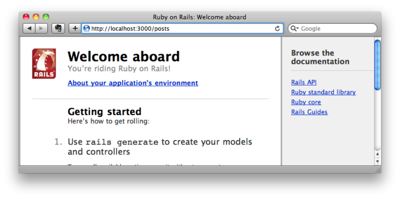

# hocus_pocus

hocus_pocus is a gem library which casts a spell on your Rails app and enables you to build your Rails app "on the fly" just like editing a Wiki.

## Features

(this documentation is copied from an ancient [blog post](https://web.archive.org/web/20120113014943/http://blog.dio.jp/2010/12/21/hocus_pocus)).


### 1. Request Driven Generator

You, well grounded Railers, always start your development with URL designing, right? You know, that's "the Rails Way". So, as you decide the URL, just put it in your browser's URL window.




This engine catches the "routing missing" sort of request, then urges you to input the parameters for the scaffold generator for the "missing" resource.


When the params are submitted, the engine kicks the scaffold generator on the server, and redirects you back to the generated index action.


This is what I meant by "request driven". This idea is strongly inspired by "Ymir" framework, which has been developed by YOKOTA Takehiko (@i_am_skirnir) in Java language. As I took a look at this, I thought, "hey, even Java can do live code generation through browser. Why can't Rails do that?"


### 2. View Editor

I guess you're always frustrated that you have to switch between your text editor and browser again and again while developing web apps. This engine magically enables you to edit your view file dynamically on your web browser just like a Wiki by clicking the "edit" button on the top right (this is why this product was previously called "wiki_mode" engine).


Of course you can edit the partials as well.


### 3. url_for-missing Driven Generator

Now, as you edit your view, you probably want to `link_to` or build a `form_for` a resource that does not exist yet, because it's a quite natural way for editing a Wiki. OK, now you can do it that way. Simply add a `link_to` like this, and submit the form.


Then another magic happens here. This time, the engine rescues "url_for missing" as well, and leads you to the generator again.


### 4. Generating Nested Resources

As you put a `link_to` a nested resource like `post_comments_path(@post)`,


the engine suggests you to generate a nested resource.


This generates a perfectly working set of code with the following routes.

```ruby
resources :posts do
  resources :comments
end
```

This is done by another library named [nested_scaffold](https://github.com/amatsuda/nested_scaffold) generator.


### 5. Steak (Capybara) Recorder

These days we're getting familiar with writing end-to-end testing in Ruby code. In the test code, we visit a page, `fill_in` text fields, `select` value from drop downs, `click` buttons, and then `assert` values in the page body by operating a virtual browser by Ruby. But, wait. Do you test only by code? Aren't you doing exactly the same thing by hand anyway? And isn't it easier and faster to manipulate the browser than writing Ruby code? So, isn't it nice if an integration test scenario can automatically be generated while you operate your browser? This engine records what you did in your browser,


and outputs a scenario for Steak (Capybara).


Comparing to usual generator generated test cases, this scenario might be quite useful and practical since it uses the actual data you entered.


### 6. Speed

This is not actually a "feature", but an unignorable benefit of this product. Every time we hit "rails" command or "rake" command on Rails 3, we're forced to wait several seconds for the Rails process to start up. However, because the generator is directly executed inside the running Rails server process, the hocus_pocus generator runs incredibly fast. When you run the generator from browser, it actually invokes

```sh
% rails generate scaffold
% rake db:migrate
```

and usually finishes within a second on my mac.


## Demo

Finally, to see how it works, [here's my live demonstration video](http://www.nicovideo.jp/watch/sm12976168) at Sapporo RubyKaigi 03.

Though the talk were in japanese, I think you all can get the idea since the main part of the talk were live demo.

I know it's super buggy ATM (thus still versioned as 0.0.0), needs tons of improvement, but has a great potential to change your development style. The source code is of course available on GitHub.

Have fun!


## Questions, Feedback

Feel free to message me on Github (amatsuda) or Twitter (@a_matsuda)  ☇3☇3☇3


## Contributing to hocus_pocus

* Fork, fix, then send me a pull request.


## Copyright

Copyright (c) 2010- Akira Matsuda. See MIT-LICENSE for
further details.
